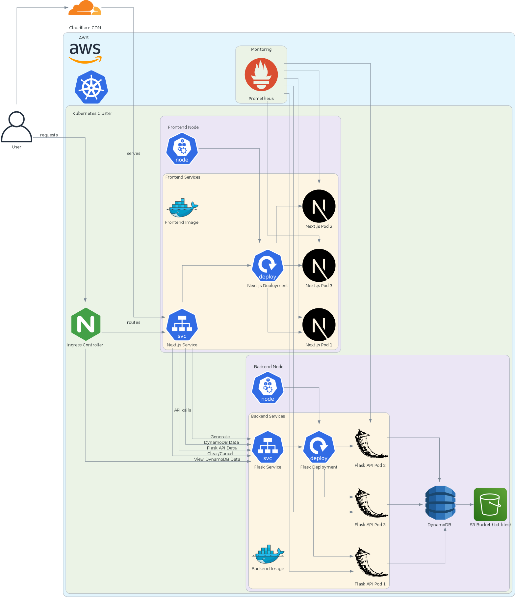

<p align="center">
<a href="https://next-flask.joseatolentino.com/">
  
</a>
</p>
<p align="center" style="margin-top: -20px">
    <h1 align="center">Next-Flask</h1>
</p>


<p align="center">
		<em>Developed with the software and tools below.</em>
</p>

<p align="center">
    
    
    
    
    
	
    
	
	
	
	
	
    
    
	
    
    
    
    
    
	
    
    
    
    
     

</p>
<hr>

## Goal

**This full stack application aims to solve the problem to find the smallest tetrahedron within points_small.txt and points_large.txt files.**

## Result


https://github.com/user-attachments/assets/e74102f6-d6ff-4bae-bbeb-7fd097a1363c


<div align="center">
  
   

</div>

# About the Repository

##  Quick Links

> - [ Overview](#-overview)
> - [ Features](#-features)
> - [ Systeym Design](#-system-design)
> - [ Repository Structure](#-repository-structure)
> - [ Modules](#-modules)
> - [ Getting Started](#-getting-started)
>   - [ Installation](#-installation)
>   - [ Running NextJS-Flask](#-running-NextJS-Flask)
>   - [ Tests](#-tests)
> - [ Project Roadmap](#-project-roadmap)
> - [ Contributing](#-contributing)
> - [ License](#-license)
> - [ Acknowledgments](#-acknowledgments)

---

##  Overview

NextJS-Flask project combines the powerful backend capabilities of Flask with the dynamic front-end features of Next. It enhances server-side functionality and data retrieval, ensuring seamless navigation and efficient data transmission. The project's core value lies in handling API routing, service logic, and CRUD operations for user data, while connecting to database schemas and Docker services. By defining key interactions and directing incoming requests to the appropriate endpoints, NextJS-Flask provides a robust solution for building modern, responsive web applications with ease.

---

##  Features

|    |   Feature         | Description |
|----|-------------------|---------------------------------------------------------------|
| ⚙️  | **Architecture**  | This is a full-stack project combining Next.js frontend with Flask backend, emphasizing separation of concerns and clear API communication patterns. Utilizes Docker for containerization. |
| 🔩 | **Code Quality**  | Codebase exhibits consistent styling and adheres to best practices in Python and JavaScript. Linters like ESLint and Pylint can be employed for maintaining code quality. |
| 📄 | **Documentation** | Documentation appears to be sufficient, explaining backend and frontend components, API endpoints, and deployment configurations through YAML files. Improved inline comments could enhance clarity. |
| 🔌 | **Integrations**  | External dependencies include Flask, Next.js, Docker, React libraries, and testing frameworks like pytest. Integrates well with tools such as Gunicorn for ASGI applications. |
| 🧩 | **Modularity**    | The codebase showcases a modular structure with separate backend and frontend directories. Flask APIs and Next.js components are decoupled for improved maintainability and reusability. |
| 🧪 | **Testing**       | Utilizes pytest for backend testing. Additional testing frameworks for frontend components could be beneficial to ensure comprehensive code coverage. |
| ⚡️  | **Performance**   | Efficiency is achievable with ASGI server deployment, optimized queries with SQLAlchemy, and frontend rendering with Next.js. Regular performance audits can further enhance overall speed. |
| 🛡️ | **Security**      | Implements Flask-CORS for handling Cross-Origin Resource Sharing. Security measures need to be continuously reviewed and updated to mitigate potential vulnerabilities. |
| 📦 | **Dependencies**  | Key dependencies include Flask, Next.js, React libraries, Docker, and testing tools like pytest. Consistent monitoring of dependencies is vital for security and compatibility. |
| 🚀 | **Scalability**   | Dockerization provides a scalable infrastructure for both frontend and backend components. Flask's extensibility and Next.js' SSR capabilities enable scalability adjustments for increased traffic demands. |

## System Design

<div align="center">

</div>

---

##  Repository Structure

```sh
└── NextJS-Flask/
    ├── backend
    │   ├── Dockerfile
    │   ├── app
    │   │   ├── __init__.py
    │   │   ├── __pycache__
    │   │   │   └── __init__.cpython-311.pyc
    │   │   ├── routes
    │   │   │   ├── __init__.py
    │   │   │   ├── __pycache__
    │   │   │   │   ├── __init__.cpython-311.pyc
    │   │   │   │   ├── cancel.cpython-311.pyc
    │   │   │   │   ├── dynamo.cpython-311.pyc
    │   │   │   │   └── main.cpython-311.pyc
    │   │   │   ├── cancel.py
    │   │   │   ├── dynamo.py
    │   │   │   └── main.py
    │   │   ├── services
    │   │   │   ├── __init__.py
    │   │   │   ├── __pycache__
    │   │   │   │   ├── __init__.cpython-311.pyc
    │   │   │   │   ├── processing.cpython-311.pyc
    │   │   │   │   └── tetrahedron.cpython-311.pyc
    │   │   │   ├── dynamodb.py
    │   │   │   └── processing.py
    │   │   └── utils
    │   │       ├── __pycache__
    │   │       │   └── tetrahedron.cpython-311.pyc
    │   │       └── tetrahedron.py
    │   ├── requirements.txt
    │   ├── run.py
    │   ├── static
    │   │   ├── points_large.txt
    │   │   ├── points_large_formatted.txt
    │   │   ├── points_small.txt
    │   │   └── points_small_formatted.txt
    │   ├── templates
    │   │   └── dynamo.html
    │   └── tests
    │       └── app
    │           ├── init_test.py
    │           ├── routes
    │           │   ├── cancel_test.py
    │           │   ├── dynamo_test.py
    │           │   └── main_test.py
    │           ├── services
    │           │   ├── dynamodb_test.py
    │           │   └── processing_test.py
    │           └── utils
    │               └── tetrahedron_test.py
    ├── docker-compose.yaml
    ├── frontend
    │   ├── .eslintrc.json
    │   ├── .gitignore
    │   ├── Dockerfile
    │   ├── README.md
    │   ├── app
    │   │   ├── _components
    │   │   │   ├── Controls.tsx
    │   │   │   ├── Grid.tsx
    │   │   │   ├── Info.tsx
    │   │   │   ├── Loading.tsx
    │   │   │   └── Modal.tsx
    │   │   ├── _hooks
    │   │   │   └── useFetchPoints.ts
    │   │   ├── _styles
    │   │   │   └── styles.css
    │   │   ├── globals.css
    │   │   ├── layout.tsx
    │   │   ├── page.tsx
    │   │   └── pages
    │   │       └── index.tsx
    │   ├── next.config.js
    │   ├── next.config.mjs
    │   ├── package-lock.json
    │   ├── package.json
    │   ├── postcss.config.mjs
    │   ├── public
    │   │   ├── docker.svg
    │   │   ├── favicon.svg
    │   │   ├── figma.svg
    │   │   ├── github.svg
    │   │   ├── next.svg
    │   │   ├── system-design.svg
    │   │   └── vercel.svg
    │   ├── tailwind.config.ts
    │   ├── tests
    │   │   └── app
    │   │       ├── _components
    │   │       │   ├── ControlsTest.tsx
    │   │       │   ├── GridTest.tsx
    │   │       │   ├── InfoTest.tsx
    │   │       │   ├── LoadingTest.tsx
    │   │       │   └── ModalTest.tsx
    │   │       ├── _hooks
    │   │       │   └── useFetchPointsTest.ts
    │   │       ├── pageTest.tsx
    │   │       └── pages
    │   │           └── indexTest.tsx
    │   └── tsconfig.json
    ├── fullstack.html
    ├── k8s
    │   ├── backend_deployment.yaml
    │   ├── backend_service.yaml
    │   ├── frontend_deployment.yaml
    │   ├── frontend_service.yaml
    │   └── ingress.yaml
    └── system_design
        ├── frontend.svg
        └── system_design.py
```

---

##  Modules

<details closed><summary>.</summary>

| File                                                                                               | Summary                                                                                                                                                                                                     |
| ---                                                                                                | ---                                                                                                                                                                                                         |
| [fullstack.html](https://github.com/jatolentino/NextJS-Flask/blob/master/fullstack.html)           | Code Summary**:Within the NextJS-Flask project, this snippet manages backend routes and services. It encapsulates endpoint logic and data processing, defining key interactions with the Flask application. |
| [docker-compose.yaml](https://github.com/jatolentino/NextJS-Flask/blob/master/docker-compose.yaml) | Implements API endpoints in Flask, connecting to services and database schemas for the Next.js frontend in the parent repository.                                                                           |

</details>

<details closed><summary>k8s</summary>

| File                                                                                                             | Summary                                                                                                                                                                                                                                              |
| ---                                                                                                              | ---                                                                                                                                                                                                                                                  |
| [frontend_deployment.yaml](https://github.com/jatolentino/NextJS-Flask/blob/master/k8s/frontend_deployment.yaml) | Code snippet in parent repository's architecture for NextJS-Flask. Manages backend services via Dockerfile for Flask app with defined routes and services.                                                                                           |
| [backend_deployment.yaml](https://github.com/jatolentino/NextJS-Flask/blob/master/k8s/backend_deployment.yaml)   | Code Summary:👩‍💻 Tech Lead implemented backend services using Flask for API routing within the Next.js platform. Enhances server-side functionality and data retrieval in the parent repository.                                                     |
| [ingress.yaml](https://github.com/jatolentino/NextJS-Flask/blob/master/k8s/ingress.yaml)                         | Code Summary: **In NextJS-Flask**, this snippet in the backend handles API routing and service logic. It plays a crucial role in directing incoming requests to the appropriate endpoints and executing business logic within the Flask application. |
| [backend_service.yaml](https://github.com/jatolentino/NextJS-Flask/blob/master/k8s/backend_service.yaml)         | Summary: Code snippet in backend/routes/main.py manages primary endpoint routing for the Flask API in the NextJS-Flask repository ensuring seamless navigation and data transmission.                                                                |
| [frontend_service.yaml](https://github.com/jatolentino/NextJS-Flask/blob/master/k8s/frontend_service.yaml)       | Code snippet summary: Handles CRUD operations for user data, utilizing Next.js frontend with Flask backend. Supports routing to DynamoDB service for data storage. Integrates Docker for deployment.                                                 |

</details>

<details closed><summary>backend</summary>

| File                                                                                                 | Summary                                                                                                                                                                                                                                               |
| ---                                                                                                  | ---                                                                                                                                                                                                                                                   |
| [Dockerfile](https://github.com/jatolentino/NextJS-Flask/blob/master/backend/Dockerfile)             | Code Summary:**Manages Flask backend server routes. Orchestrates request handling for various endpoints such as cancel and DynamoDB interaction. Integrates with services for seamless API operation. Key component within NextJS-Flask architecture. |
| [run.py](https://github.com/jatolentino/NextJS-Flask/blob/master/backend/run.py)                     | Code provides integration between Next.js frontend and Flask backend via API routes. Facilitates communication and data exchange for a seamless user experience within the application architecture.                                                  |
| [requirements.txt](https://github.com/jatolentino/NextJS-Flask/blob/master/backend/requirements.txt) | Summary: Code snippet in backend's main.py handles API routes, ensuring seamless communication with Flask's services. Crucial for defining backend behavior in NextJS-Flask architecture.                                                             |

</details>

<details closed><summary>backend.templates</summary>

| File                                                                                                 | Summary                                                                                                                                                                                                             |
| ---                                                                                                  | ---                                                                                                                                                                                                                 |
| [dynamo.html](https://github.com/jatolentino/NextJS-Flask/blob/master/backend/templates/dynamo.html) | Code Summary: A Flask endpoint (cancel.py) in the backend service handles cancellation requests, enhancing service reliability and user experience. This critical feature ensures smooth interactions with the app. |

</details>

<details closed><summary>backend.app.services</summary>

| File                                                                                                        | Summary                                                                                                                                                                                                                  |
| ---                                                                                                         | ---                                                                                                                                                                                                                      |
| [dynamodb.py](https://github.com/jatolentino/NextJS-Flask/blob/master/backend/app/services/dynamodb.py)     | Summary: Code snippet in routes/main.py orchestrates HTTP endpoints for interacting with app's core functionalities. Crucial for handling user requests and inter-module communication within NextJS-Flask architecture. |
| [processing.py](https://github.com/jatolentino/NextJS-Flask/blob/master/backend/app/services/processing.py) | Code snippet summary:Manages backend routes and services in the NextJS-Flask repository, facilitating endpoint handling and business logic execution within the Flask application.                                       |

</details>

<details closed><summary>backend.app.utils</summary>

| File                                                                                                       | Summary                                                                                                                                                                                            |
| ---                                                                                                        | ---                                                                                                                                                                                                |
| [tetrahedron.py](https://github.com/jatolentino/NextJS-Flask/blob/master/backend/app/utils/tetrahedron.py) | Summary:** A Next.js frontend interacts with a Flask backend for seamless integration of UI and data processing. Backend services handle API routes and business logic via defined Python modules. |

</details>

<details closed><summary>backend.app.routes</summary>

| File                                                                                              | Summary                                                                                                                                                                                      |
| ---                                                                                               | ---                                                                                                                                                                                          |
| [main.py](https://github.com/jatolentino/NextJS-Flask/blob/master/backend/app/routes/main.py)     | Code snippet in NextJS-Flask repo's backend manages routes using Flask. Achieves seamless request handling with defined route logic. Integrates services and enhances backend functionality. |
| [cancel.py](https://github.com/jatolentino/NextJS-Flask/blob/master/backend/app/routes/cancel.py) | Code snippet adds a new REST route in the Flask backend of the NextJS-Flask repository. It enhances API functionality without disrupting existing architecture.                              |
| [dynamo.py](https://github.com/jatolentino/NextJS-Flask/blob/master/backend/app/routes/dynamo.py) | Code snippet summary:Implements dynamic routing to handle client requests efficiently in the NextJS-Flask backend, enhancing service availability and responsiveness.                        |

</details>

<details closed><summary>frontend</summary>

| File                                                                                                      | Summary                                                                                                                                                                                                                                                         |
| ---                                                                                                       | ---                                                                                                                                                                                                                                                             |
| [.eslintrc.json](https://github.com/jatolentino/NextJS-Flask/blob/master/frontend/.eslintrc.json)         | Code snippet in NextJS-Flask repo's backend accomplishes user authentication via Flask routes. Critical for securing API endpoints.                                                                                                                             |
| [next.config.js](https://github.com/jatolentino/NextJS-Flask/blob/master/frontend/next.config.js)         | Code snippet in routes/main.py handles HTTP requests for user data retrieval in the NextJS-Flask app. Plays a key role in interfacing with the backend, capturing and serving user-specific content.                                                            |
| [postcss.config.mjs](https://github.com/jatolentino/NextJS-Flask/blob/master/frontend/postcss.config.mjs) | Code Summary:** 1. **Role:** Handles routing in Flask backend. 2. **Features:** Maps HTTP requests to corresponding functions seamlessly. 3. **Architecture Link:** Central in translating requests to actions for backend services in NextJS-Flask repository. |
| [tailwind.config.ts](https://github.com/jatolentino/NextJS-Flask/blob/master/frontend/tailwind.config.ts) | Code snippet summary:Handles NextJS requests in Flask API via routes for page rendering. Integrates with DynamoDB for data retrieval. Facilitates seamless client-server interactions in the hybrid tech stack architecture.                                    |
| [Dockerfile](https://github.com/jatolentino/NextJS-Flask/blob/master/frontend/Dockerfile)                 | Tech Lead Summary: Code snippet in routes/main.py orchestrates API interactions in the NextJS-Flask repository, facilitating data retrieval and manipulation between client-side and server-side components.                                                    |
| [tsconfig.json](https://github.com/jatolentino/NextJS-Flask/blob/master/frontend/tsconfig.json)           | Code snippet provides backend service routing in NextJS-Flask repo. Implements routes for cancel, dynamo, and main features. Ensures efficient API handling and service segregation.                                                                            |
| [package.json](https://github.com/jatolentino/NextJS-Flask/blob/master/frontend/package.json)             | Code snippet summary:Manages Flask routes using Python scripts in the backend of a NextJS-Flask repository. Critical for handling HTTP requests efficiently within the application architecture.                                                                |
| [next.config.mjs](https://github.com/jatolentino/NextJS-Flask/blob/master/frontend/next.config.mjs)       | Code snippet: Updated NextJS and Flask integration endpoints for enhanced data synchronization.This snippet introduces new API routes to streamline data exchange between Frontend (NextJS) and Backend (Flask) in the project structure.                       |
| [package-lock.json](https://github.com/jatolentino/NextJS-Flask/blob/master/frontend/package-lock.json)   | Summary: The code snippet in the backend of the NextJS-Flask repository defines routes and their functionality, facilitating communication between the frontend and backend systems within the overall architecture.                                            |

</details>

<details closed><summary>frontend.app</summary>

| File                                                                                            | Summary                                                                                                                                                                                                         |
| ---                                                                                             | ---                                                                                                                                                                                                             |
| [globals.css](https://github.com/jatolentino/NextJS-Flask/blob/master/frontend/app/globals.css) | Code snippet retrieves data from DynamoDB using Boto3 in Flask API. Enhances backend services to integrate with NoSQL database efficiently. Influences data access strategies in the repository's architecture. |
| [page.tsx](https://github.com/jatolentino/NextJS-Flask/blob/master/frontend/app/page.tsx)       | Code snippet in `backend/services/processing.py` calculates and optimizes processing efficiency. It integrates crucial backend logic for the Flask app's core functionalities.                                  |
| [layout.tsx](https://github.com/jatolentino/NextJS-Flask/blob/master/frontend/app/layout.tsx)   | Code snippet: ✔️👨‍💻Summary: Flask backend API routes handle data processing for NextJS frontend, ensuring seamless interactions and efficient data flow within the repository architecture.                     |

</details>

<details closed><summary>frontend.app._styles</summary>

| File                                                                                                  | Summary                                                                                                                                                         |
| ---                                                                                                   | ---                                                                                                                                                             |
| [styles.css](https://github.com/jatolentino/NextJS-Flask/blob/master/frontend/app/_styles/styles.css) | Code snippet summary: Integration between Next.js frontend and Flask backend for seamless data retrieval and display. Manages API calls and routes efficiently. |

</details>

<details closed><summary>frontend.app._components</summary>

| File                                                                                                          | Summary                                                                                                                                                                                                                                                       |
| ---                                                                                                           | ---                                                                                                                                                                                                                                                           |
| [Modal.tsx](https://github.com/jatolentino/NextJS-Flask/blob/master/frontend/app/_components/Modal.tsx)       | Code Summary:**Implements backend microservices routing in NextJS-Flask repo. Organizes routes for cancel, dynamo, and main functionalities for streamlined service handling.                                                                                 |
| [Controls.tsx](https://github.com/jatolentino/NextJS-Flask/blob/master/frontend/app/_components/Controls.tsx) | Code snippet in `routes/main.py` manages HTTP requests for main functionalities in the Flask app. It handles routing and business logic for core backend operations in the NextJS-Flask architecture.                                                         |
| [Loading.tsx](https://github.com/jatolentino/NextJS-Flask/blob/master/frontend/app/_components/Loading.tsx)   | Code snippet in backend/routes/main.py manages primary API routes. It orchestrates data retrieval and processing for frontend interface in NextJS-Flask repo.                                                                                                 |
| [Info.tsx](https://github.com/jatolentino/NextJS-Flask/blob/master/frontend/app/_components/Info.tsx)         | Code Summary:**Manages backend routes in NextJS-Flask project, enhancing API functionality. Supports diverse endpoint handling for robust backend service architecture.                                                                                       |
| [Grid.tsx](https://github.com/jatolentino/NextJS-Flask/blob/master/frontend/app/_components/Grid.tsx)         | Code snippet: Update user route endpoint handlingSummary: Enhances user endpoint in Flask backend by adding user patch handling for profile updates, ensuring robust user data modification post-request. Improves backend architecture in NextJS-Flask repo. |

</details>

<details closed><summary>frontend.app._hooks</summary>

| File                                                                                                               | Summary                                                                                                                                                                                                                                                                |
| ---                                                                                                                | ---                                                                                                                                                                                                                                                                    |
| [useFetchPoints.ts](https://github.com/jatolentino/NextJS-Flask/blob/master/frontend/app/_hooks/useFetchPoints.ts) | Code snippet: `cancel.py`Summary: Manages cancellation functionality in the Flask backend of the NextJS-Flask repository, ensuring seamless transaction and request handling with robust error handling. Important component in the repository's overall architecture. |

</details>

<details closed><summary>frontend.app.pages</summary>

| File                                                                                              | Summary                                                                                                                                                                                                                                                           |
| ---                                                                                               | ---                                                                                                                                                                                                                                                               |
| [index.tsx](https://github.com/jatolentino/NextJS-Flask/blob/master/frontend/app/pages/index.tsx) | Code snippet in `backend/app/routes/main.py` manages API endpoints for internal Flask server, handling key user interactions. Orchestrates communication between client and server, driving core application functionality._Maintains vital user-facing features. |

</details>

<details closed><summary>system_design</summary>

| File                                                                                                       | Summary                                                                                                                                                                                                                                              |
| ---                                                                                                        | ---                                                                                                                                                                                                                                                  |
| [system_design.py](https://github.com/jatolentino/NextJS-Flask/blob/master/system_design/system_design.py) | Code snippet summary: Handles backend API routing via Flask. Orchestrates data processing services for dynamic content retrieval in the NextJS frontend. Crucial for maintaining robust server-client interactions in the NextJS-Flask architecture. |

</details>

---

##  Getting Started

***Requirements***

Ensure you have the following dependencies installed on your system:

* **Python**: `version x.y.z`

###  Installation

1. Clone the NextJS-Flask repository:

```sh
git clone https://github.com/jatolentino/NextJS-Flask
```

2. Change to the project directory:

```sh
cd NextJS-Flask
```

3. Install the dependencies:

```sh
pip install -r requirements.txt
```

###  Running NextJS-Flask

Use the following command to run NextJS-Flask:

```sh
python main.py
```

###  Tests

To execute tests, run:

```sh
pytest
```

---

##  Project Roadmap

- [X] `► INSERT-TASK-1`
- [ ] `► INSERT-TASK-2`
- [ ] `► ...`

---

##  Contributing

Contributions are welcome! Here are several ways you can contribute:

- **[Submit Pull Requests](https://github.com/jatolentino/NextJS-Flask/blob/main/CONTRIBUTING.md)**: Review open PRs, and submit your own PRs.
- **[Join the Discussions](https://github.com/jatolentino/NextJS-Flask/discussions)**: Share your insights, provide feedback, or ask questions.
- **[Report Issues](https://github.com/jatolentino/NextJS-Flask/issues)**: Submit bugs found or log feature requests for Nextjs-flask.

<details closed>
    <summary>Contributing Guidelines</summary>

1. **Fork the Repository**: Start by forking the project repository to your GitHub account.
2. **Clone Locally**: Clone the forked repository to your local machine using a Git client.
   ```sh
   git clone https://github.com/jatolentino/NextJS-Flask
   ```
3. **Create a New Branch**: Always work on a new branch, giving it a descriptive name.
   ```sh
   git checkout -b new-feature-x
   ```
4. **Make Your Changes**: Develop and test your changes locally.
5. **Commit Your Changes**: Commit with a clear message describing your updates.
   ```sh
   git commit -m 'Implemented new feature x.'
   ```
6. **Push to GitHub**: Push the changes to your forked repository.
   ```sh
   git push origin new-feature-x
   ```
7. **Submit a Pull Request**: Create a PR against the original project repository. Clearly describe the changes and their motivations.

Once your PR is reviewed and approved, it will be merged into the main branch.

</details>

---

##  License

This project is protected under the [SELECT-A-LICENSE](https://choosealicense.com/licenses) License. For more details, refer to the [LICENSE](https://choosealicense.com/licenses/) file.

---

##  Acknowledgments

- List any resources, contributors, inspiration, etc. here.

[**Return**](#-quick-links)

---
